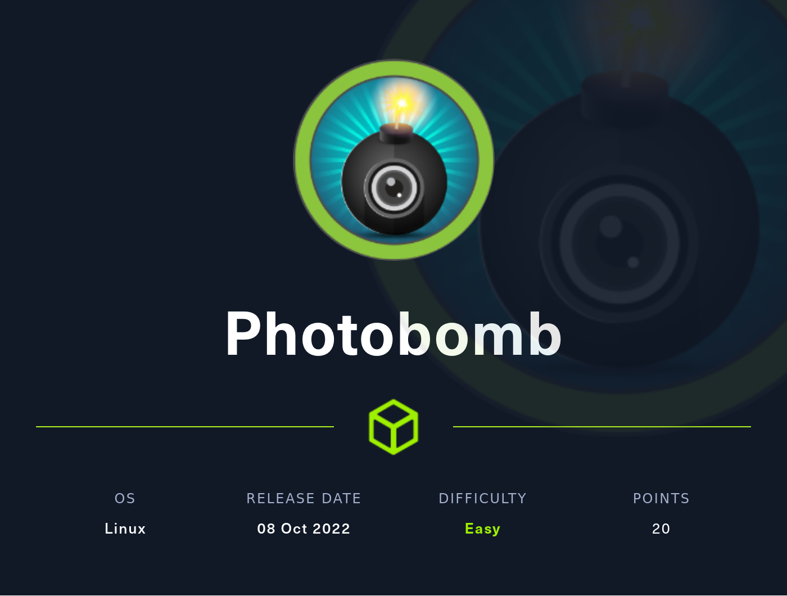

# HackTheBox Photobomb Writeup
<!-- Description -->

Completed on ??/??/20??
<!-- /Description -->
## Table of Contents
<!-- TOC -->
- [HackTheBox - Photobomb - WriteUp](#hackthebox-photobomb-writeup)
  - [Table of Contents](#table-of-contents)
  - [Let's Get Going!](#lets-get-going)
    - [Enumeration](#enumeration)
      - [Nmap Scan](#nmap-scan)
    - [Exploitation](#exploitation)
    - [Post Exploitation](#post-exploitation)
<!-- /TOC -->
---
## Let's Get Going
### Enumeration
#### Nmap Scan
We start as usual with the nmap scan 
```bash
$ nmap -sC -sV -oN nmap/initial $IP
Starting Nmap 7.93 ( https://nmap.org ) at 2023-01-31 13:48 EST
Nmap scan report for 10.10.11.182
Host is up (0.094s latency).
Not shown: 998 closed tcp ports (conn-refused)
PORT   STATE SERVICE VERSION
22/tcp open  ssh     OpenSSH 8.2p1 Ubuntu 4ubuntu0.5 (Ubuntu Linux; protocol 2.0)
| ssh-hostkey: 
|   3072 e22473bbfbdf5cb520b66876748ab58d (RSA)
|   256 04e3ac6e184e1b7effac4fe39dd21bae (ECDSA)
|_  256 20e05d8cba71f08c3a1819f24011d29e (ED25519)
80/tcp open  http    nginx 1.18.0 (Ubuntu)
|_http-server-header: nginx/1.18.0 (Ubuntu)
|_http-title: Did not follow redirect to http://photobomb.htb/
Service Info: OS: Linux; CPE: cpe:/o:linux:linux_kernel
```
Lets explore further http on port 80
#### Nikto scan
We run the nikto scan to get a primary view of possible problems with our website
```bash
$ nikto -h http://$IP
- Nikto v2.1.6
---------------------------------------------------------------------------
+ Target IP:          10.10.11.182
+ Target Hostname:    10.10.11.182
+ Target Port:        80
+ Start Time:         2023-01-31 13:48:51 (GMT-5)
---------------------------------------------------------------------------
+ Server: nginx/1.18.0 (Ubuntu)
+ The anti-clickjacking X-Frame-Options header is not present.
+ The X-XSS-Protection header is not defined. This header can hint to the user agent to protect against some forms of XSS
+ The X-Content-Type-Options header is not set. This could allow the user agent to render the content of the site in a different fashion to the MIME type
+ Root page / redirects to: http://photobomb.htb/
+ No CGI Directories found (use '-C all' to force check all possible dirs)
+ The anti-clickjacking X-Frame-Options header is not present.
+ The X-XSS-Protection header is not defined. This header can hint to the user agent to protect against some forms of XSS
+ The site uses SSL and the Strict-Transport-Security HTTP header is not defined.
+ The site uses SSL and Expect-CT header is not present.
+ 1 host(s) tested
+ End Time:           2023-01-31 14:08:06 (GMT-5) (1155 seconds)
---------------------------------------------------------------------------
```
#### Directory Fuzzing
Upon starting the directory fuzzing with ffuf, we get plenty of results right away with response status 302
```bash
$ ffuf -w /usr/share/wordlists/dirbuster/directory-list-2.3-medium.txt -u http://$IP/FUZZ -e ".php,.html"

        /'___\  /'___\           /'___\       
       /\ \__/ /\ \__/  __  __  /\ \__/       
       \ \ ,__\\ \ ,__\/\ \/\ \ \ \ ,__\      
        \ \ \_/ \ \ \_/\ \ \_\ \ \ \ \_/      
         \ \_\   \ \_\  \ \____/  \ \_\       
          \/_/    \/_/   \/___/    \/_/       

       v1.5.0 Kali Exclusive <3
________________________________________________

 :: Method           : GET
 :: URL              : http://10.10.11.182/FUZZ
 :: Wordlist         : FUZZ: /usr/share/wordlists/dirbuster/directory-list-2.3-medium.txt
 :: Extensions       : .php .html 
 :: Follow redirects : false
 :: Calibration      : false
 :: Timeout          : 10
 :: Threads          : 40
 :: Matcher          : Response status: 200,204,301,302,307,401,403,405,500
________________________________________________

.php                    [Status: 302, Size: 154, Words: 4, Lines: 8, Duration: 195ms]
.html                   [Status: 302, Size: 154, Words: 4, Lines: 8, Duration: 195ms]
index                   [Status: 302, Size: 154, Words: 4, Lines: 8, Duration: 192ms]
index.php               [Status: 302, Size: 154, Words: 4, Lines: 8, Duration: 193ms]
index.html              [Status: 302, Size: 154, Words: 4, Lines: 8, Duration: 195ms]
images                  [Status: 302, Size: 154, Words: 4, Lines: 8, Duration: 193ms]
download                [Status: 302, Size: 154, Words: 4, Lines: 8, Duration: 190ms]
download.php            [Status: 302, Size: 154, Words: 4, Lines: 8, Duration: 189ms]
download.html           [Status: 302, Size: 154, Words: 4, Lines: 8, Duration: 192ms]
2006                    [Status: 302, Size: 154, Words: 4, Lines: 8, Duration: 192ms]
2006.php                [Status: 302, Size: 154, Words: 4, Lines: 8, Duration: 194ms]
2006.html               [Status: 302, Size: 154, Words: 4, Lines: 8, Duration: 192ms]
news.html               [Status: 302, Size: 154, Words: 4, Lines: 8, Duration: 189ms]
serial                  [Status: 302, Size: 154, Words: 4, Lines: 8, Duration: 189ms]
serial.php              [Status: 302, Size: 154, Words: 4, Lines: 8, Duration: 191ms]
warez                   [Status: 302, Size: 154, Words: 4, Lines: 8, Duration: 191ms]
warez.php               [Status: 302, Size: 154, Words: 4, Lines: 8, Duration: 191ms]
warez.html              [Status: 302, Size: 154, Words: 4, Lines: 8, Duration: 192ms]
full.html               [Status: 302, Size: 154, Words: 4, Lines: 8, Duration: 188ms]
12                      [Status: 302, Size: 154, Words: 4, Lines: 8, Duration: 194ms]
12.php                  [Status: 302, Size: 154, Words: 4, Lines: 8, Duration: 194ms]
12.html                 [Status: 302, Size: 154, Words: 4, Lines: 8, Duration: 198ms]
contact                 [Status: 302, Size: 154, Words: 4, Lines: 8, Duration: 199ms]
```
After visiting one of it, we find an error 
#### Exploring the website
After editing /etc/hosts and visiting the website, we get the following

Clicking the hyperlink provided directs us to a login form which we will surely try to manipulate! 
---
### Exploitation
---
### Post Exploitation
---

> Any feedback would be appreciated. Thank you !
