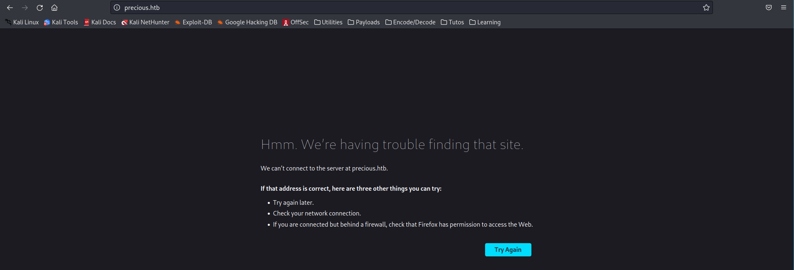
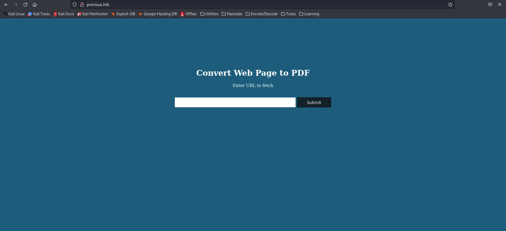
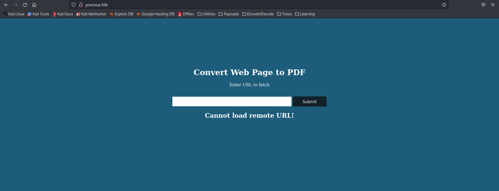
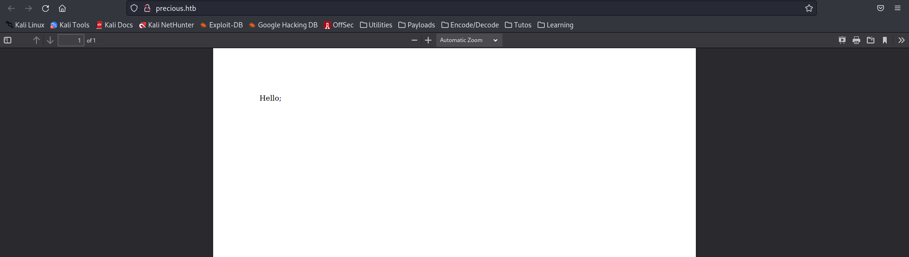
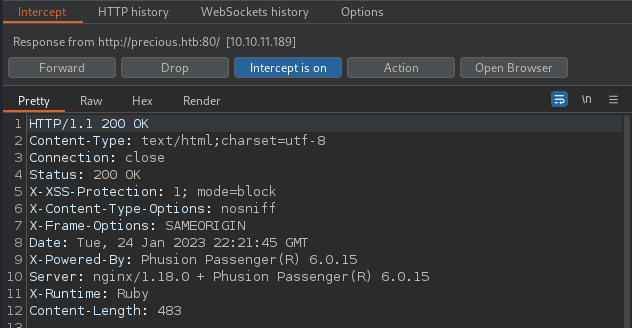

# HackTheBox Precious Writeup

<!-- Description -->


Completed on ??/??/20??
<!-- /Description -->

## Table of Contents

<!-- TOC -->
- [HackTheBox - Precious - WriteUp](#hackthebox-precious-writeup)
  - [Table of Contents](#table-of-contents)
  - [Let's Get Going!](#lets-get-going)
    - [Enumeration](#enumeration)
      - [Nmap Scan](#nmap-scan)
      - [HTTP - Port 80](#http---port-80)
    - [Exploitation](#exploitation)
    - [Post Exploitation](#post-exploitation)

<!-- /TOC -->

---

## Let's Get Going
Connect to HackTheBox network with openvpn and start scanning the machine.

### Enumeration
#### Nmap Scan
We start by running a nmap Syn Scan to find potentially open ports.
```bash
$ sudo nmap -sS -Pn -n -oN nmapss 10.10.11.189
Starting Nmap 7.93 ( https://nmap.org ) at 2023-01-24 13:10 EST
Nmap scan report for 10.10.11.189
Host is up (0.097s latency).
Not shown: 998 closed tcp ports (reset)
PORT   STATE SERVICE
22/tcp open  ssh
80/tcp open  http

Nmap done: 1 IP address (1 host up) scanned in 14.33 seconds
```
Going further we can try to version scan the two open ports in order to get more details of what we are dealing with.
```bash
$ nmap -sV -Pn -n -oN nmapsv 10.10.11.189
Starting Nmap 7.93 ( https://nmap.org ) at 2023-01-24 13:06 EST
Nmap scan report for 10.10.11.189
Host is up (0.098s latency).
Not shown: 998 closed tcp ports (conn-refused)
PORT   STATE SERVICE VERSION
22/tcp open  ssh     OpenSSH 8.4p1 Debian 5+deb11u1 (protocol 2.0)
80/tcp open  http    nginx 1.18.0
Service Info: OS: Linux; CPE: cpe:/o:linux:linux_kernel
```
So we got two open ports hosting a web app and a ssh server and we were able to determine services versions. 
For now we can continue with further scanning of each ports and finding out more about each service.

#### HTTP - Port 80
We can run now a nikto scan which runs automated scan on the web app to find more info about it.
```bash
$ nikto -h http://10.10.11.189:80/
- Nikto v2.1.6
---------------------------------------------------------------------------
+ Target IP:          10.10.11.189
+ Target Hostname:    10.10.11.189
+ Target Port:        80
+ Start Time:         2023-01-24 14:37:03 (GMT-5)
---------------------------------------------------------------------------
+ Server: nginx/1.18.0
+ The anti-clickjacking X-Frame-Options header is not present.
+ The X-XSS-Protection header is not defined. This header can hint to the user agent to protect against some forms of XSS
+ The X-Content-Type-Options header is not set. This could allow the user agent to render the content of the site in a different fashion to the MIME type
+ Root page / redirects to: http://precious.htb/
+ No CGI Directories found (use '-C all' to force check all possible dirs)

+ 7889 requests: 0 error(s) and 3 item(s) reported on remote host
+ End Time:           2023-01-24 14:51:47 (GMT-5) (884 seconds)
---------------------------------------------------------------------------
+ 1 host(s) tested
```

Nothing particularly interesting. We try now to visit the web app and see what's hosted.
Visiting $ip:80 returns an error.
The server returned 302 response to the browser and hence redirected it to the domain name precious.htb which couldn't be resolved.



To solve that we must edit /etc/hosts file and add the resolution for the browser "$ip precious.htb".
Visiting precious.htb now returns successfully the web page.



At first glance, we notice one main functionality of this web app: URL to pdf. Checking Page Source and running directory fuzzing returns no other results at all.
So it seems we have to find out more about this functionality.
Sending as input any public URL returns the following error.



So we can try setting up a local server on our machine and see if the remote server visits us.
We run the following command after creating a basic index.html file.
```bash
$ php -S 10.10.14.116:8000
[Tue Jan 24 15:05:45 2023] PHP 8.1.12 Development Server (http://10.10.14.116:8000) started
```
By inputting the address to our local server we get the visit!
```bash
[Tue Jan 24 15:07:26 2023] 10.10.11.189:51626 Accepted
[Tue Jan 24 15:07:26 2023] 10.10.11.189:51626 [200]: GET /
[Tue Jan 24 15:07:26 2023] 10.10.11.189:51626 Closing
```
On the other hand, in the browser, we get our pdf.



Going further, we try to inspect the web page with Burp Suite. Upon requesting the root directory and intercepting the response we start getting more details.



We can see a response header with the value "ruby", hinting the backend could be written in ruby. We can see as well Phantom??.. 

---

### Exploitation

---

### Post Exploitation

---
